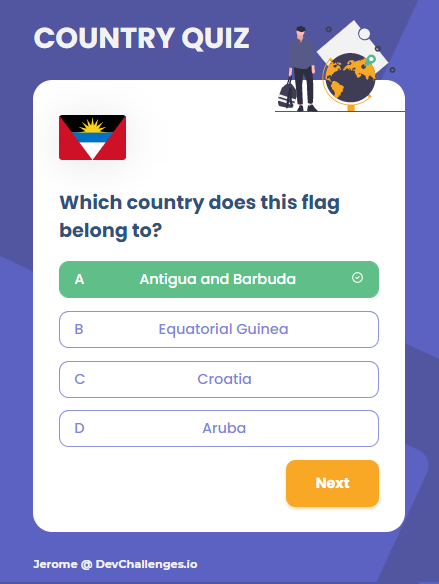

# Country Quiz

Challenge: Create a country quiz app using an API, and use React to handle the frontend. Without looking at the existing solution. Fulfill user stories below:


-   User story: User can see at least 2 types of question: a city is the capital of.. or a flag belong to country..
-   User story: User can see select an answer
-   User story: User can see if our answer is correct or incorrect
-   User story: When User answers correctly, he can move on to the next question
-   User story: When User answers incorrectly, he can see my results and try again
-   User story: User can try again

**Icon**: https://google.github.io/material-design-icons/

**API**: https://restcountries.eu/. Use data from the API to create questions and answers.

**Design** : https://www.figma.com/file/Gw0ZNBbYN8asqFlZWy3jG1

**Live app** : https://country-quiz-app.netlify.app/


Template for your readme :

<!-- Please update value in the {}  -->

<h1 align="center">{Country quiz}</h1>

<div align="center">
  <h3>
    <a href="https://j-emilien-country-quiz-app.netlify.app/">
      Demo
    </a>
    <span> | </span>
    <a href="https://github.com/Fodilahy-mena/country-quiz">
      Solution
    </a>
  </h3>
</div>

<!-- TABLE OF CONTENTS -->

## Table of Contents

-   [Overview](#overview)
    -   [Built With](#built-with)
-   [Features](#features)
-   [How to use](#how-to-use)
-   [Contact](#contact)
-   [Acknowledgements](#acknowledgements)

<!-- OVERVIEW -->

## Overview



There shown on top there is the demo of this react country quiz project.

I have done the most of it but some I couldn't handle them.

I had a serious problem when getting the random country from api. It took me for almost a day but it was solved by passing a parameter with useEffect where I run the getRandom function.
The problem happened when running getRandom function because it is running before the data api is loaded. It meant that the array which I randomized was empty (undefined). If statement did the hard work, we wait for the data api loaded before we run the getRandomCountry function.
That was one of the most challenging part of it.

Giving a specific class with clicked button (random countries choices) was quite hard but I did it with for loop. Though, we can not see a specific background color nore a cross icon with wrrong choice that the user made because I display the results stight away when the anwer is incorrect. With the right answer, we can see the tick icon.


I tried to not display the results stright away even thought the answer is incorrect but I couldn't get it work. I am not satisfied with it because, I wan't someone seeing the cross icon 
when they select the wrrong option.

Overall, it is a very good project, especially since it is a little bit challeging.

### Built With

<!-- This section should list any major frameworks that you built your project using. Here are a few examples.-->

-   [React](https://reactjs.org/)

## Features

<!-- List the features of your application or follow the template. Don't share the figma file here :) -->

## How To Use

<!-- Example: -->

To clone and run this application, you'll need [Git](https://git-scm.com) and [Node.js](https://nodejs.org/en/download/) (which comes with [npm](http://npmjs.com)) installed on your computer. From your command line:

```bash
# Clone this repository
$ git clone https://github.com/your-user-name/your-project-name

# Install dependencies
$ npm install

# Run the app
$ npm start
```

## Acknowledgements

<!-- This section should list any articles or add-ons/plugins that helps you to complete the project. This is optional but it will help you in the future. For example: -->

## Contact

<!-- -   Website [your-website.com](https://{your-web-site-link}) -->
-   GitHub [@Fodilahy-mana](https://github.com/Fodilahy-mena)
<!-- -   Twitter [@your-twitter](https://{twitter.com/your-username}) -->
